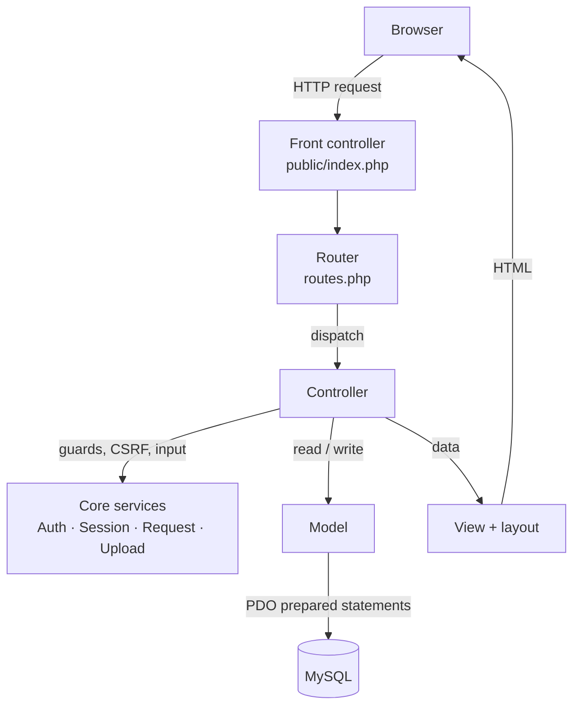
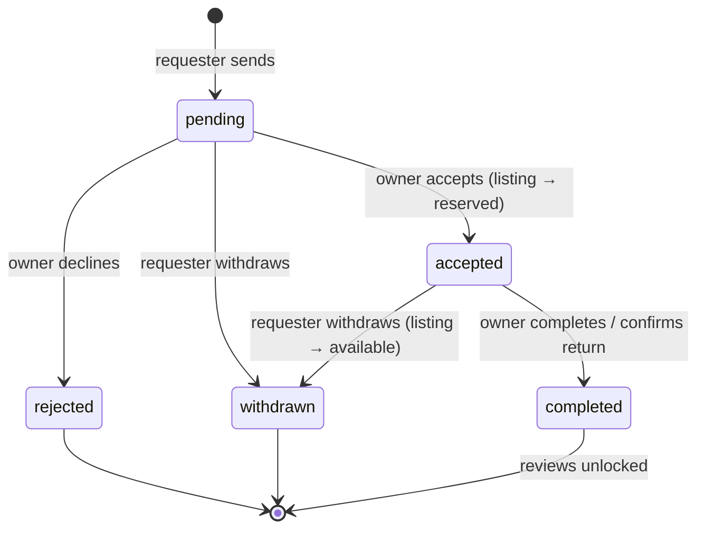

# NexUse — Architecture and Technical Guide for the Viva

*CS-31 · second-year group project · prepared 22 September 2026*

This guide explains **how NexUse is built and why**: its architecture, the design patterns
it uses, how it protects data, and the logic behind each feature. Every statement here
was checked against the code. File references are given so you can open the exact lines
if an examiner asks "show me".

Section 12 lists likely viva questions with short answers. Section 13 is a one-page
cheat sheet of the numbers.

---

## Contents

1. [NexUse in one minute](#1-nexuse-in-one-minute)
2. [Technology stack](#2-technology-stack)
3. [Architecture](#3-architecture)
4. [The framework layer we wrote](#4-the-framework-layer-we-wrote)
5. [Design patterns](#5-design-patterns)
6. [Security — hashing, tokens and "encryption"](#6-security--hashing-tokens-and-encryption)
7. [Database design](#7-database-design)
8. [Business logic](#8-business-logic)
9. [Front-end techniques](#9-front-end-techniques)
10. [Module ownership](#10-module-ownership)
11. [Known limitations and what comes next](#11-known-limitations-and-what-comes-next)
12. [Likely viva questions](#12-likely-viva-questions)
13. [Cheat sheet — the numbers](#13-cheat-sheet--the-numbers)

---

## 1. NexUse in one minute

NexUse is a web platform for Sri Lanka's circular economy. One member lists an item they
no longer use, as one of four **exchange types**:

| Type | What happens | Ownership | Payment |
|---|---|---|---|
| **Sell** | Buyer requests, seller accepts, they complete the exchange | Transferred | Arranged between the two parties, off-platform |
| **Rent** | Renter requests dates, lender accepts, item is returned and its condition recorded | Stays with lender | Off-platform |
| **Share** | Like renting, but free | Stays with lender | None |
| **Donate** | Receiver requests, donor accepts and hands it over | Transferred | None |

Every exchange follows the same path: **list → request → accept → hand over → complete →
review**. Around it sit chat, notifications, complaints and an admin area.

The system is written in **plain PHP, MySQL, HTML, CSS and JavaScript, with no framework
and no external libraries**, as the proposal committed to. We wrote our own small MVC
framework, described in section 4.

---

## 2. Technology stack

| Layer | Technology | Why |
|---|---|---|
| Browser | HTML5, hand-written CSS, vanilla JavaScript | The proposal rules out frameworks; this keeps every line explainable by its author |
| Server | PHP 8.5 (`declare(strict_types=1)` in every file) | Widely hosted, integrates directly with MySQL |
| Database | MySQL 8.0, InnoDB engine, `utf8mb4` character set | Relational data with foreign keys and transactions; utf8mb4 stores Sinhala, Tamil and emoji correctly |
| Data access | PDO with prepared statements | The standard, safe way to talk to a database from PHP |
| Web server | PHP's built-in server (development); Apache via XAMPP also supported | `public/router.php` and `public/.htaccess` do the same job, so the code runs on either unchanged |
| Version control | Git | Commit history per module |

PHP extensions used: `pdo_mysql`, `session`, `mbstring`. The `gd` and `fileinfo` extensions
are **not** installed, which is why uploads are checked with `getimagesize()` (section 6.7).

---

## 3. Architecture

### 3.1 The big picture

NexUse is a **three-tier** web application — browser, PHP application, MySQL database — and
the PHP tier is organised as **Model–View–Controller (MVC)** behind a single **front
controller**.



| MVC part | Responsibility in NexUse | Rule we follow |
|---|---|---|
| **Model** (`app/Models/`, 10 classes) | All database access, one class per table | SQL is written **only** in models |
| **View** (`app/Views/`, 46 templates) | HTML output | Views never query the database; every value is escaped with `e()` |
| **Controller** (`app/Controllers/`, 14 classes) | Checks access, validates input, calls models, chooses a view | Controllers contain no SQL and no HTML |

### 3.2 Folder structure

```
NexUse/
├── public/              ← the ONLY folder the web server exposes
│   ├── index.php        front controller: every request enters here
│   ├── router.php       dev-server router (serves real files, else index.php)
│   ├── .htaccess        the same rule for Apache; also disables directory listing
│   └── assets/          app.css, app.js, uploads/
├── app/
│   ├── Core/            our framework: Router, Controller, Model, Database, Auth,
│   │                    Session, Request, View, Upload, Config
│   ├── Models/          one class per table
│   ├── Controllers/     one per module (+ Admin/)
│   ├── Views/           layouts/, partials/, errors/, one folder per module
│   └── Helpers/         functions.php — 28 small view helpers
├── config/              config.local.php (database password, git-ignored) + example
├── database/            schema.sql, seed.sql, setup.sql, migrations 002 and 003
├── bootstrap.php        autoloader, error settings, timezone, session start
└── routes.php           every URL in the system (54 routes)
```

**Why only `public/` is exposed:** the application code, the configuration file holding the
database password, and the SQL scripts all sit *outside* the web root, so a browser
cannot request them — even if the server were misconfigured to show PHP source.

### 3.3 The life of one request

Take `POST /requests/12/respond` — an owner accepting a request.

| Step | Where | What happens |
|---|---|---|
| 1 | `public/router.php` or `.htaccess` | Not a real file, so it is handed to `index.php` |
| 2 | `public/index.php` → `bootstrap.php` | Defines `BASE_PATH`, registers the autoloader, loads helpers, sets the timezone to `Asia/Colombo`, starts the session |
| 3 | `routes.php` | Registers all 54 routes with the router |
| 4 | `Router::dispatch()` | Matches `POST /requests/{id}/respond`, extracts `12` as an integer, calls `RequestController::respond(12)` |
| 5 | `RequestController::respond()` | `Auth::requireLogin()`, `requirePost()`, `verifyCsrf()` |
| 6 | same | Loads the request; refuses with 403 unless this user is its owner; refuses unless the status is `pending` |
| 7 | Models | `ItemRequest::update()` → `accepted`; `Listing::setStatus()` → `reserved`; `Notification::raise()` for the requester |
| 8 | Controller | Sets a flash message and **redirects** to `/requests/12` (Post/Redirect/Get) |
| 9 | Browser | Follows the redirect with a GET; the router calls `show(12)`; the view renders inside the layout; the flash message appears once |

---

## 4. The framework layer we wrote

All in `app/Core/`. These classes are what every module is built on.

### 4.1 Router — `app/Core/Router.php`

- Holds two tables, `GET` and `POST`, mapping a path to `[ControllerClass, 'method']`.
- `form()` registers the same path for both GET (show the form) and POST (process it).
- **Matching:** an exact match is tried first. Otherwise, route patterns such as
  `/listings/{id}` are turned into a regular expression where `{id}` becomes `([0-9]+)`.
  **Only digits match**, so `/listings/abc` is a 404, and the captured value is converted
  with `intval` before it reaches the controller.
- A subtle detail: `{id}` is swapped for a placeholder *before* `preg_quote()`, because
  quoting would otherwise escape the braces and the pattern would never match.
- **Correct HTTP errors:** a path that exists only for the other method returns **405
  Method Not Allowed**, not 404. Unknown paths return **404**; missing controllers return
  **500**.

### 4.2 Controller — `app/Core/Controller.php` (abstract)

The base class every controller extends. It provides:

| Method | Purpose |
|---|---|
| `view()` | Render a template inside the layout |
| `redirect()` | Send a `Location` header and stop (`never` return type) |
| `back()` | Return to the previous page, **but only if the referer is this same site** |
| `notFound()`, `forbidden()` | Render the 404 or 403 page with the right status code |
| `verifyCsrf()` | Reject a forged form submission (section 6.3) |
| `flash()` | Queue a one-time message for the next page |
| `redirectWithErrors()` | Keep what the user typed, store the field errors, redirect back to the form |
| `requirePost()` | Refuse state-changing actions sent as GET |

### 4.3 Model — `app/Core/Model.php` (abstract)

Generic CRUD for any table: `find`, `all`, `create`, `update`, `delete`, `count`,
`exists`. Each concrete model sets two static properties — `$table` and `$key` — and the
base class uses **late static binding** (`static::$table`) to build its SQL for that
table. Models add their own query methods on top, such as `Listing::search()` and
`ItemRequest::receivedBy()`.

### 4.4 Database — `app/Core/Database.php`

- **One PDO connection per request**, created lazily the first time it is needed and
  reused after that.
- Connection options:
  - `ERRMODE_EXCEPTION` — a failed query throws, so errors are never silently ignored;
  - `FETCH_ASSOC` — rows come back as associative arrays;
  - `EMULATE_PREPARES = false` — **real server-side prepared statements**: MySQL receives
    the SQL and the values separately.
- Helpers `run`, `one`, `all`, `value`, `lastId`, plus `begin`, `commit` and `rollBack`
  for transactions.
- Charset `utf8mb4` is set in the connection string.

### 4.5 View — `app/Core/View.php`

- `render()` first **captures** the page template into a string with output buffering,
  then renders the shared **layout** with that string as `$content`. Every page therefore
  gets the same header, navigation, flash messages, footer and dialogs.
- `partial()` includes a reusable fragment: the listing card, admin menu, donation dialog
  and notifications dialog.
- Variables are passed with `extract($data, EXTR_SKIP)`, which never overwrites an
  existing variable.

### 4.6 Session — `app/Core/Session.php`

- Starts the session with a cookie that is **HttpOnly** (JavaScript cannot read it) and
  **SameSite=Lax** (not sent on cross-site form posts).
- **Flash messages:** stored in the session, removed the moment they are read.
- **Old input and errors:** when validation fails, what the user typed is remembered —
  **except passwords and the CSRF token**, which are stripped out — so the form can be
  refilled.
- **CSRF tokens** — section 6.3.
- `destroy()` clears the data, expires the cookie, destroys the session, then starts a
  fresh one with a new id.

### 4.7 Auth — `app/Core/Auth.php`

- `login()` calls `session_regenerate_id(true)` and stores **only the user id** in the
  session, never the password or the whole user record.
- `user()` **re-reads the account from the database on every request** (cached for that
  request). If the account was deleted or **suspended** since the user signed in, the
  session is destroyed at once — a suspension takes effect on the member's very next
  click.
- **Guards:** `requireLogin()` remembers the page the user wanted and redirects to sign-in;
  `requireAdmin()` returns 403 to members; `requireGuest()` keeps signed-in users away
  from the sign-in and register pages.
- `owns()` — an ownership check used before editing or deleting anything.

### 4.8 Request — `app/Core/Request.php`

Typed, trimmed input: `post()` returns a trimmed string, `postInt()` and `queryInt()`
return an integer or `null`, and `raw()` is used for passwords so their spaces are
preserved. `files()` reshapes PHP's awkward multi-file upload array into a clean list.
`path()` strips the configured `base_url`, so the application also runs from a
sub-folder.

### 4.9 Upload — `app/Core/Upload.php`

Image validation and storage; see section 6.7.

### 4.10 Config — `app/Core/Config.php`

Reads `config/config.local.php` once and caches it. If the file is missing, the
application stops with a clear setup message rather than a PHP error.

### 4.11 Autoloader and helpers

- `bootstrap.php` registers a **PSR-4-style autoloader**: the class `App\Core\Router` is
  loaded from `app/Core/Router.php`, so no file needs a `require` for a class.
- `app/Helpers/functions.php` holds 28 view helpers: `e()` (escaping), `url()`, `asset()`,
  `money()`, `time_ago()`, `stars()`, `avatar()`, `csrf_field()`, labels for types and
  conditions, and others.

---

## 5. Design patterns

| Pattern | Where | Why we used it |
|---|---|---|
| **Model–View–Controller** | The whole application | Separates data, presentation and control, so four people can work in parallel without editing the same files |
| **Front Controller** | `public/index.php` | One entry point: every request is bootstrapped, secured and routed the same way |
| **Routing table** | `routes.php` + `Router` | Every URL in one file; clean addresses such as `/listings/5/edit` instead of file paths |
| **Table Data Gateway** | Each model, e.g. `Listing`, `ItemRequest` | One class owns all SQL for one table and returns plain arrays |
| **Inheritance / template method** | Abstract `Controller` and `Model` | Common behaviour written once; each subclass supplies only what differs (`$table`, `$key`, its own actions) |
| **Late static binding** | `static::$table` in `Model` | The shared CRUD methods act on the right table for each subclass |
| **Lazy initialisation / shared instance** | `Database::connection()`, `Config::all()` | The connection and configuration are created once, only when first needed |
| **Per-request caching (memoisation)** | `Auth::user()` | The signed-in user is loaded once per request, not once per call |
| **Two Step View / layout** | `View::render()` | The page is rendered first, then wrapped in the shared layout |
| **Partials (composite views)** | `app/Views/partials/` | Listing card, admin menu and dialogs written once, reused everywhere |
| **Post/Redirect/Get** | Every form handler | Refreshing a page never re-submits a form |
| **Flash messages** | `Session::flash()` / `takeFlash()` | A one-time message survives exactly one redirect |
| **Guard clauses** | `requireLogin`, `requireAdmin`, ownership and status checks at the top of actions | Refuse early; the rest of the method can assume the checks passed |
| **Finite state machine** | Request status (section 8.2) | An exchange can only move in allowed steps |
| **Allow-listing (whitelisting)** | Exchange types, conditions, sort orders, request decisions | Only known values are accepted; anything else is ignored |
| **Synchronizer token** | CSRF protection | Standard defence against cross-site request forgery |
| **Progressive enhancement** | `app.js`, dialogs | Everything works without JavaScript; scripts only improve it |
| **Autoloading (PSR-4 style)** | `bootstrap.php` | Classes load on demand from their namespace |

**What we deliberately did not use** — examiners sometimes ask:

- **No ORM.** Models return arrays, and queries are written by hand. This keeps the SQL
  visible and explainable.
- **No dependency-injection container.** Core services are static classes. That is simple,
  but harder to unit-test; see section 11.
- **No event bus or observer.** Modules raise notifications by calling
  `Notification::raise()` directly. It is easy to follow; the trade-off is tighter coupling.

---

## 6. Security — hashing, tokens and "encryption"

### 6.1 First, the difference between hashing and encryption

Be precise about this in the viva:

| | **Hashing** | **Encryption** |
|---|---|---|
| Direction | One-way — cannot be reversed | Two-way — can be decrypted with a key |
| Used for | Passwords: we only need to *check* them, never read them back | Data that must be read later |
| In NexUse | **Yes** — every password, with bcrypt | **Not used for stored data** (see 6.9) |

So the accurate answer to "what encryption does NexUse use?" is: **passwords are
protected by one-way bcrypt hashing, security tokens come from a cryptographically secure
random generator, and encryption in transit (HTTPS/TLS) is provided by the web server when
the site is deployed.**

### 6.2 Passwords — bcrypt

| Aspect | Detail | Where |
|---|---|---|
| Algorithm | **bcrypt** through `password_hash($password, PASSWORD_DEFAULT)` — hashes start `$2y$` | `User::register()`, `User::setPassword()` |
| Work factor | **Cost 12** (PHP 8.5's default): 2¹² = 4,096 rounds, deliberately slow to make guessing expensive | — |
| Salt | A unique random salt is generated for every password and stored inside the hash, so identical passwords produce different hashes | automatic |
| Checking | `password_verify()`, which compares in constant time | `AuthController::login()` |
| Upgrading | `password_needs_rehash()` on every sign-in: if PHP's default algorithm or cost increases, the stored hash is silently upgraded | `AuthController::login()` |
| Rules | At least 8 characters; must be typed twice on registration | `AuthController::register()` |
| Never stored or repeated | Plain passwords are never saved, logged, or put back into a form after an error | `Session::remember()` strips them |

**Why bcrypt and not MD5 or SHA-256?** Those are *fast* hashes, designed for speed, so an
attacker with a stolen database can try billions of guesses per second. bcrypt is
deliberately slow and salted, which makes that kind of attack impractical.

### 6.3 Cross-site request forgery (CSRF) — synchronizer tokens

The threat: another website secretly submits a form to NexUse using the victim's
signed-in session.

| Step | Detail |
|---|---|
| Token | `bin2hex(random_bytes(32))` — **256 bits from PHP's cryptographically secure random generator**, 64 hexadecimal characters, one per session (`Session::csrfToken()`) |
| Sent | Every POST form includes it as a hidden field via `csrf_field()` |
| Checked | `Session::verifyCsrf()` compares with **`hash_equals()`** — a constant-time comparison, so an attacker cannot learn the token one character at a time from response timings |
| Failure | The request stops with HTTP **419** ("page expired") and nothing is changed |
| Second layer | The session cookie is `SameSite=Lax`, so browsers do not send it on cross-site POSTs anyway |

Sign-out is also a POST with a token, so a malicious link or image cannot sign someone out.

### 6.4 SQL injection — prepared statements

- **Every value** reaches the database through a `?` placeholder in a PDO prepared
  statement. With emulation turned off, MySQL receives the SQL and the data separately,
  so data can never be run as SQL.
- Values that cannot be placeholders are **allow-listed or cast**:
  - sort order is chosen with a PHP `match` over fixed options (`Listing::search()`);
  - exchange types and conditions are checked with `in_array(..., true)`;
  - `LIMIT` and `OFFSET` are cast with `(int)`;
  - route ids are digits only (section 4.1).
- **Likely question:** the base `Model` builds column names from array keys. Those arrays
  are always written by our controllers — for example `['title' => $title, ...]` — and
  never taken directly from the request, so no user input reaches an identifier.

### 6.5 Cross-site scripting (XSS) — output escaping

- Every dynamic value in every view goes through **`e()`** — `htmlspecialchars()` with
  `ENT_QUOTES | ENT_SUBSTITUTE` and UTF-8 — so `<script>` typed into a listing title is
  shown as text, never run.
- `ENT_QUOTES` also escapes quotes, which protects values placed inside HTML attributes.
- `ENT_SUBSTITUTE` replaces invalid byte sequences instead of returning an empty string.

### 6.6 Sessions, authentication and access control

| Protection | How |
|---|---|
| Session fixation | `session_regenerate_id(true)` on sign-in and sign-out, so an id planted before sign-in is useless afterwards |
| Session theft by script | HttpOnly cookie |
| Minimal session data | Only `user_id` is stored; the user is re-read from the database on every request |
| Suspension works immediately | `Auth::user()` destroys the session if the account is now suspended |
| User enumeration | A wrong email and a wrong password give the **same** message: "Those details do not match an account." |
| Open redirect | After sign-in the user returns to the page they wanted — but only if it is a same-site path (starts with `/`, not `//`). `back()` only follows a same-host referer |
| Role check | `requireAdmin()` protects all admin pages (403 for members) |
| Ownership checks | Only the owner can edit or delete a listing, respond to or complete a request, or edit a review or complaint; everyone else gets 403 |
| Participant checks | Only the two people in a conversation can read it, and only the two parties to an exchange can review it |

### 6.7 File uploads — `app/Core/Upload.php`

Uploads are a classic attack route (for example, a PHP script disguised as `photo.jpg`).
Each file must pass every check:

1. PHP reported no upload error.
2. **Size ≤ 2 MB.**
3. `is_uploaded_file()` — it really arrived through an HTTP upload.
4. **`getimagesize()` must read it as an image.** This checks the file's actual content, not
   its name or the browser-supplied MIME type, both of which an attacker controls.
5. The detected image type must be JPEG, PNG, GIF or WEBP — an **allow-list**.
6. The file is saved under a **new random name**, `bin2hex(random_bytes(16))` (128 bits).
   The extension comes from the *detected* type, never from the user's filename.
7. Only a **relative path** (`assets/uploads/…`) is stored, keeping the database portable.

On deletion, `Upload::delete()` only removes paths that start with `assets/uploads/`, which
prevents path-traversal tricks such as `../../config/config.local.php`.

### 6.8 Privacy logic

| Data | Who can see it | Where it is enforced |
|---|---|---|
| Item locations, member profile pages | Signed-in members only | `location_or_prompt()` helper; `ProfileController::publicProfile()` requires login; the browse **location filter** is also ignored for guests, otherwise `?location=Colombo` would reveal the hidden data |
| Email and phone number | Only the other party, and only once a request is **accepted** or **completed** | `app/Views/requests/show.php` (`$sharedContact`) |
| Demo account passwords | Not shown on any page | Kept in `demo-accounts.txt`, outside `public/` |
| Database password | Nowhere public | `config/config.local.php` is outside the web root and ignored by git |

### 6.9 What we do not do yet — be honest about this

| Not done | Why, and the plan |
|---|---|
| **Encryption of stored data** | Nothing stored needs to be read back secretly; passwords are hashed rather than encrypted. If sensitive data were added, it would be encrypted with an authenticated cipher such as AES-256-GCM through PHP's `openssl` or `sodium` functions |
| **HTTPS / TLS** | The development server is plain HTTP on localhost. On deployment, TLS is configured on the web server and the session cookie is marked `Secure` |
| **Rate limiting** | Repeated sign-in attempts are not yet throttled; a `login_attempts` table is planned (task 15) |
| **Security headers** | A Content-Security-Policy and similar headers are planned |
| **Email verification** | Built in an earlier iteration (codes were bcrypt-hashed, expired after 10 minutes and allowed 5 attempts), then removed by group decision because the machines cannot send email. An admin-granted verified badge is planned instead |

---

## 7. Database design

### 7.1 Tables

Ten tables, InnoDB, `utf8mb4`:

| Table | Holds |
|---|---|
| `users` | Accounts; `role` is `admin` or `member`, `status` is `active` or `suspended` |
| `categories` | Item categories |
| `listings` | Items offered; `listing_type` is sell, rent, share or donate |
| `listing_images` | Photos per listing; `is_primary` marks the main one |
| `requests` | Requests to buy, rent, borrow or receive, with dates and return condition |
| `reviews` | 1–5 ratings after a completed exchange |
| `complaints` | Reports against a member and/or listing |
| `notifications` | Per-user alerts and admin broadcasts |
| `conversations` | One chat thread per (listing, interested member) |
| `messages` | Messages within a conversation |

### 7.2 Design decisions

- **Third normal form.** Repeating data sits in its own table (photos, messages), and
  categories are referenced by id.
- **Surrogate integer primary keys** (`AUTO_INCREMENT`) on every table.
- **Foreign keys with explicit actions:**
  - `ON DELETE CASCADE` — deleting a user removes their listings, requests, reviews and
    notifications; deleting a listing removes its photos and requests;
  - `ON DELETE SET NULL` — deleting a category leaves its listings uncategorised rather
    than deleting them.
- **Unique constraints that enforce business rules in the database itself:**
  - `uq_users_email` — one account per email address;
  - `uq_categories_slug` — unique category URLs;
  - `uq_review_per_request (request_id, reviewer_id)` — **one review per person per
    exchange**, even if the application check were bypassed;
  - `uq_conversation (listing_id, buyer_id)` — one chat thread per item and buyer.
- **Indexes** on the columns used for filtering: listing status and type, request status,
  and notifications by `(user_id, is_read)` for the unread count.
- **`requests` stores both `requester_id` and `owner_id`.** The owner could be found through
  the listing, but storing it keeps "requests I received" a single indexed lookup, and it
  records who owned the item at the time of the request.
- **Derived values are calculated, never stored:** a member's average rating, the rating
  breakdown, unread counts and dashboard figures come from queries, so they can never
  drift out of date.
- `item_condition` is not called `condition` because **CONDITION is a reserved word in
  MySQL**.
- **Migrations:** `migration_002_features.sql` added chat; `migration_003_remove_otp.sql`
  removed the email-code table. Both can be run safely more than once.

---

## 8. Business logic

### 8.1 Exchange types to request types

| Listing type | Request type | Returnable? | On completion, the listing becomes… |
|---|---|---|---|
| sell | buy | No | `completed` (item gone) |
| donate | donation | No | `completed` |
| rent | rent | **Yes** — dates required | `available` again |
| share | borrow | **Yes** — dates required | `available` again |

`is_returnable()` in the helpers decides which rules apply.

### 8.2 The request state machine



**Rules enforced in `RequestController`:**

- **Sending:** you cannot request your own listing; the listing must be `available`; you
  cannot hold two live requests on the same item (`ItemRequest::liveFor`). For rent and
  share the start date cannot be in the past, and the return date must be on or after
  the start date.
- **Responding:** only the owner, only while `pending`, and the decision must be exactly
  `accept` or `reject`. On accept, the owner may adjust the dates, the listing becomes
  `reserved`, and the requester is notified.
- **Completing:** only the owner, only when `accepted`. For rentals the owner records the
  actual return date and the **return condition**: as given, minor damage, major damage,
  or not returned.
- **Withdrawing:** only the requester, while `pending` or `accepted`. Withdrawing an
  accepted request releases the listing back to `available`.
- **Other pending requests** on the same item are *not* cancelled when one is accepted.
  They stay pending for the owner to decline, and no new ones can be sent because the
  listing is now reserved.

### 8.3 Reviews and ratings

- Allowed only when the request is `completed`, only for its two parties, and only once
  each (checked in code *and* by the unique key).
- **Average rating:** `SELECT AVG(rating), COUNT(*) … WHERE reviewee_id = ?`, rounded to one
  decimal place (`User::rating()`).
- **Rating breakdown:** `GROUP BY rating`, filled into a 1-to-5 array so empty levels show
  as 0 (`Review::distributionFor()`). Each bar's width is its share of all reviews.

### 8.4 Search, filters and pagination

- **Keyword search** matches the title, description **and category name**, so "electronics"
  finds the category as well as the word (`Listing::buildFilters()`).
- **Filters:** exchange type, category, condition, new or used, minimum and maximum price,
  and location (members only). The maximum price keeps free items in
  (`price IS NULL OR price <= ?`).
- **Relevance sort:** a match in the title ranks above a match in the description only.
- **Pagination:** 12 per page; the page number is clamped between 1 and the last page.
- **Related items** are ranked by a small scoring formula rather than a strict filter, so
  the section is never empty:
  **score = 4 × same category + 2 × same exchange type + 1 × same location**, then newest
  first (`Listing::related()`).

### 8.5 Messaging

- One conversation per (listing, interested member), created on first contact
  (`Conversation::findOrCreate`, backed by the unique key).
- Owners cannot start a chat about their own listing.
- Only the two participants may open a thread. Administrators may too, because they
  investigate complaints — this is stated in the privacy notice.
- Messages are limited to 2,000 characters. Unread counts drive the badge in the header.

### 8.6 Notifications

`Notification::raise()` is called at each event. Every notification has a type, title,
message and a link to the relevant page.

| Event | Who is notified |
|---|---|
| Request sent | The owner |
| Request accepted or declined | The requester |
| Request withdrawn | The owner |
| Exchange completed or return confirmed | The requester |
| Review written | The member reviewed |
| Message sent | The recipient |
| Complaint filed | Every administrator |
| Complaint status changed | The complainant |
| Account suspended or reactivated | That member |
| Broadcast | Every active member of the chosen group |
| Registration | The new member (a welcome message) |

Members can mark notifications read or unread, mark all read, dismiss one, or clear all
read ones.

### 8.7 Administration

- **Dashboard:** counts of users, listings, requests and reviews; listings by type and
  requests by status as bar charts; the newest listings and requests; open complaints.
- **Users:** search, filter by role and status, add, edit, suspend and delete. An admin
  cannot remove their own admin role or suspend themselves.
- **Categories:** add, rename and delete; deleting one leaves its listings uncategorised.
- **Complaints:** status open → reviewing → resolved or dismissed, with a note the
  complainant can read. The platform records outcomes but does not enforce them, as the
  proposal's scope says.
- **Broadcast:** notify everyone, only members, or only admins.

### 8.8 Validation, and how errors reach the user

1. The controller validates each field and collects messages in an `$errors` array.
2. `redirectWithErrors()` stores the errors and the typed input (never passwords) in the
   session, then redirects back to the form.
3. The form shows each error beside its field and refills the values with `old()`.

This is Post/Redirect/Get applied to validation, so a refresh never re-submits.

---

## 9. Front-end techniques

### 9.1 CSS — `public/assets/css/app.css` (about 2,060 lines, 21 sections)

- A **design system** built on CSS custom properties (tokens) such as `--blue`, `--green`
  and `--radius`, taken from the NexUse logo colours: blue `#2563C9`, green `#12945A`.
- Reusable components: buttons, cards, tables, badges, alerts, empty states, dialogs.
- **Responsive layout** with CSS Grid and Flexbox and breakpoints at 960px, 720px and 620px.
  Every page was measured at 390px (phone) and 1,894px wide with no sideways scrolling.
- **Pinned browse filters** with `position: sticky`, active only above 960px.
- No CSS framework and no CDN.

### 9.2 JavaScript — `public/assets/js/app.js` (about 440 lines, no libraries)

The rule is **progressive enhancement**: every feature works without JavaScript, and
scripts only improve it.

| Function | What it adds |
|---|---|
| `initModals()` | Donation and notification dialogs: Escape to close, focus kept inside the dialog, focus returned to the button afterwards, page scroll locked. **Without JavaScript** they still open, through a `#id` link and the CSS `:target` selector |
| `initCopyButtons()` | Copy buttons for the bank details, using the Clipboard API with an older fallback |
| `initPasswordToggles()` | A "show password" button on password fields |
| `initImagePreview()`, `initAvatarPreview()` | Preview photos before uploading |
| `initListingTypeFields()` | Show the price field only for sell and rent |
| `initDateRange()` | Stop the return date from being set before the start date |
| `initConfirms()` | "Are you sure?" before a delete (`data-confirm`) |
| `initDropdowns()`, `initNavToggle()` | Account menu and mobile navigation |
| `initAutoSubmit()`, `initGallery()`, `initChatScroll()` | Filters apply on change; photo gallery; chat opens at the newest message |

The script is loaded with `defer` and wrapped in an IIFE, so it adds nothing to the global
scope.

### 9.3 Accessibility

Every form control has a label. Dialogs use `role="dialog"` and `aria-modal`, and can be
used entirely by keyboard. The unread badge has screen-reader text ("3 unread"). The
decorative logo is `aria-hidden`.

---

## 10. Module ownership

| Member | Module | Graded CRUD entity | Main files |
|---|---|---|---|
| Member 1 | Listings and catalogue | `listings` | `ListingController`, `HomeController`; `Listing`, `ListingImage`, `Category` |
| Member 2 | Requests, rentals and messaging | `requests` | `RequestController`, `MessageController`; `ItemRequest`, `Conversation`, `Message` |
| Member 3 | Profiles, reviews and complaints | `reviews` | `ProfileController`, `ReviewController`, `ComplaintController`, `PageController`; `Review`, `Complaint` |
| Member 4 | Authentication, notifications and administration | `notifications` | `AuthController`, `NotificationController`, `Admin/*`; `User`, `Notification` |
| All | Shared foundations | — | `app/Core`, layout, CSS and JS, database schema |

**Tip:** each member should be ready to walk through their own controller's
create-read-update-delete methods and the model queries behind them.

---

## 11. Known limitations and what comes next

| Limitation | Planned response |
|---|---|
| Donation requests and pledges (from the proposal) not built | New `donation_requests` and `pledges` tables |
| No return reminders, late alerts or compensation claims | Planned; see the full-system ER diagram |
| No sign-in rate limiting or security headers | `login_attempts` table and a CSP header |
| Accepting a request and reserving the listing are two separate writes, not one transaction | Wrap them in `Database::begin()` … `commit()` |
| Static core classes make unit testing harder | Add plain-PHP tests for the business rules; consider injecting dependencies |
| Only the browse page is paginated | Paginate requests, notifications and admin lists |
| Photos stored at full size (`gd` not installed) | Resize on upload once `gd` is available |
| Plain HTTP in development | HTTPS on deployment, `Secure` cookie flag |

---

## 12. Likely viva questions

**Why no framework, such as Laravel?**
The proposal committed to plain PHP with no external libraries. Writing our own small MVC
layer means every line can be explained by its author — which is what the individual
assessment tests.

**What is MVC, and where is it in your code?**
The model is data access (`app/Models`), the view is HTML templates (`app/Views`), and
the controller is request handling (`app/Controllers`). SQL appears only in models and
HTML only in views.

**What is a front controller?**
A single entry point, `public/index.php`, that every request goes through, so bootstrap,
session, security and routing happen in one place.

**How do you store passwords?**
With bcrypt through `password_hash()`, cost 12, with a random salt per password. We verify
with `password_verify()` and upgrade old hashes with `password_needs_rehash()`. The
password itself is never stored.

**Is bcrypt encryption?**
No — it is a one-way hash, so it cannot be decrypted, and it doesn't need to be: we only
ever check a password, never read it back.

**How do you prevent SQL injection?**
PDO prepared statements with emulation turned off, so values never become SQL. Sort
orders and enum values are allow-listed, and numbers are cast to integers.

**How do you prevent XSS?**
Every output goes through `e()`, which is `htmlspecialchars` with `ENT_QUOTES`.

**What is CSRF and how do you stop it?**
It's a forged form submission from another site. Each form carries a 256-bit random token
that must match the session's copy, compared with `hash_equals`; otherwise the request
gets 419. The session cookie is also `SameSite=Lax`.

**What is session fixation?**
An attacker plants a known session id before the victim signs in. We call
`session_regenerate_id(true)` at sign-in and sign-out, so that id stops working.

**What stops a member from editing someone else's listing?**
Ownership checks: the controller compares the listing's `user_id` with the signed-in user
and returns 403 if they differ.

**How is an uploaded file checked?**
Size, `is_uploaded_file`, and `getimagesize` to confirm it really is an image, then an
allow-list of image types, a random file name, and a relative path.

**What happens when an admin suspends a member who is signed in?**
`Auth::user()` re-reads the account on every request, sees `suspended`, and ends the
session on their next click.

**Why store `owner_id` in `requests` when the listing already has an owner?**
It makes "requests I received" one indexed query, and it records who owned the item at
the time of the request.

**How do you stop duplicate reviews?**
In the controller and with the database's unique key on `(request_id, reviewer_id)`.

**How is a member's rating calculated?**
`AVG(rating)` over the reviews they received, rounded to one decimal place. It is
calculated on demand, not stored, so it is always current.

**What is Post/Redirect/Get and why use it?**
After a form POST we redirect to a GET page, so refreshing the page does not submit the
form again.

**What if JavaScript is disabled?**
Everything still works — progressive enhancement. The dialogs even open through CSS
`:target`.

**How does the router handle `/listings/5`?**
`{id}` becomes the regular expression `([0-9]+)`, and the captured value is converted to an
integer before it reaches the controller. Non-numeric ids give a 404.

**Which HTTP status codes do you use?**
200, 302 (redirect), 403 (forbidden), 404 (not found), 405 (wrong method), 419 (invalid
CSRF token) and 500 (server error).

**What would you improve?**
Transactions around multi-step updates, sign-in rate limiting, HTTPS and security
headers on deployment, automated tests, and the planned features: donation pledges,
rental reminders and compensation claims.

---

## 13. Cheat sheet — the numbers

| | |
|---|---|
| PHP files | 87 — 10 core, 10 models, 14 controllers, 46 views, 1 helper file, 6 entry and config |
| Routes | 54 |
| Database tables | 10 (full planned system: 20) |
| View helpers | 28 |
| CSS | about 2,060 lines, 21 sections |
| JavaScript | about 440 lines, no libraries |
| Graded CRUD operations | 16 — 4 members × 4 operations, all complete |
| Password hashing | bcrypt, cost 12, per-password salt |
| CSRF token | 256-bit, `random_bytes(32)`, compared with `hash_equals` |
| Upload file names | 128-bit random, `random_bytes(16)` |
| Upload limit | 2 MB; JPEG, PNG, GIF, WEBP |
| Session cookie | HttpOnly, SameSite=Lax; id regenerated at sign-in and sign-out |
| Browse page size | 12 listings |
| Related-items score | 4 × category + 2 × type + 1 × location |
| Message limit | 2,000 characters |
| Timezone | Asia/Colombo |
